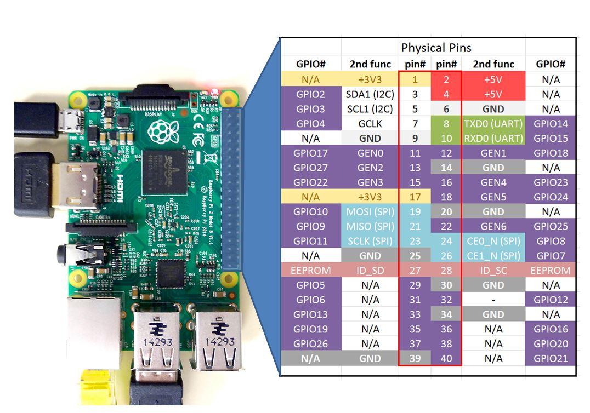

use github action for binary

rename old to burnmaid-private
create new public repository

test install script from beginning: erase current SD...

# Burnmaid
ceramic burner control using Raspberry Pi with temperatur sensor and radio-controlled socket.

## Buy
* [Converter analog-digital (MAX31855: 14 bit SPI, 0-1350°C)](https://www.reichelt.de/entwicklerboards-thermoelement-verstaerker-max31855-debo-amp-thermo-p235483.html?&trstct=pos_0&nbc=1)
* [Temperatur Sensor type K](https://www.amazon.de/dp/B0C3GNB56N?psc=1&ref=ppx_yo2ov_dt_b_product_details)

* [Power Plugs (1000W max, 1200W tested)](https://www.amazon.de/gp/product/B001AX8QUM/ref=ppx_yo_dt_b_asin_title_o04_s00?ie=UTF8&psc=1)
* [Power Plug Receiver/Tranceiver](https://www.amazon.de/gp/product/B071J2Z3YK/ref=ppx_yo_dt_b_asin_title_o05_s00?ie=UTF8&psc=1)

* [Raspberry Pi Zero 2 W](https://www.amazon.de/Raspberry-Pi-Zero-2-W/dp/B09KLVX4RT/ref=sr_1_2?keywords=zero+2+w&qid=1704284508&sr=8-2)
* [Raspberry Power Supply](https://www.amazon.de/Raspberry-Netzteil-Ladeger%C3%A4t-Netzschalter-Kompatibel/dp/B07G953WC3/ref=sr_1_4?keywords=netzteil+5v+3a+usb&qid=1704284890&sr=8-4)
* [Raspberry SD](https://www.amazon.de/gp/product/B073K14CVB/ref=ppx_yo_dt_b_asin_title_o00_s00?ie=UTF8&psc=1)
* [Raspberry Jumper Wires](https://www.amazon.de/dp/B07KYHBVR7/?coliid=I2EG3536DCC8YH&colid=1MCC6B4CV7811&psc=1&ref_=cm_sw_r_cp_ud_lstpd_2SZTYQ5CQSNAM2HX19FF)

## Wire

#### Raspberry
* 5V-3A over USB-Mini

#### MAX31855
* "VCC" -> 3.3V
* "GND" -> GND
* "DO" -> GPIO-9 = SO = MISO
* "CS" -> GPIO-10 = MOSI
* "CLK" -> GPIO-11 = SCLK

#### 433Mhz Sender
* "\+" -> 5V
* "\-" -> GND
* "DATA" -> GPIO-17

#### 433Mhz Receiver
* "VCC" -> 5V
* "GND" -> GND
* "DATA" -> GPIO-27

## Install
Simply execute this line on your raspbberry pi's home directory:

    curl "https://raw.githubusercontent.com/martinbreu/burnmaid/main/INSTALL.sh" | sudo bash

and open http://burnmaid:8080

### Setup radio-controlled sockets:

            ssh pi@burnmaid
            python3 burnmaid/cmd/script/plugsniffer.py

* Press the remote control button very near to the receiver. Repeat until script prints a result.

* use the result to update these files:

            nano burnmaid/data/plug_on.json
            nano burnmaid/data/plug_off.json

## (Optional) Setup Raspberry SD:
- Install Raspberry Pi Imager

   Ubuntu: 
         
         sudo snap install rpi-imager
    Windows:
    
        https://downloads.raspberrypi.org/imager/imager_latest.exe

- Run Raspberry "Imager":
  - CHOOSE OS: "Raspberry Pi OS (Legazy, 32-bit) Lite"
  - CHOOSE STORAGE: Insert SD-Memory-Card and select
  - NEXT
  - EDIT SETTINGS: hostname=burnmaid, username=pi, WLAN
  - SERVICES: Enable SSH, public-key
  - SAVE, Yes, Yes

- Insert SD into Pi, power up, and ssh into Pi, replacing USERNAME and HOSTNAME:

      ssh USERNAME@HOSTNAME

## helpful developer commands / Troubleshoot

### Wrong Temperatur:
* The sensor has a polarity, reverse if temperature goes reverse
* the converter has a temperatur sensor itself to calibrate. I think only a second after power up, so place at sensor and converter at same temperature at beginning.
* Every converter is for a special sensor type
* Buy high-quality hardware: converter, sensor, raspberry, sd-card
* restart

#### update

cd cmd;scp pi@burnmaid:/home/pi/burnmaid/data/* ../data/;git add --all; git commit -m "backup";git push;env GOOS=linux GOARCH=arm GOARM=6 go build;ssh pi@burnmaid sudo systemctl stop burnmaid;scp -rp * pi@burnmaid:/home/pi/burnmaid/cmd/;ssh pi@burnmaid sudo systemctl start burnmaid

#### extra
ssh pi@burnmaid mkdir -p /home/pi/burnmaid/data/
ssh pi@burnmaid mkdir -p /home/pi/burnmaid/cmd/
scp ../data/* pi@burnmaid:/home/pi/burnmaid/data/

scp -rp html/* pi@burnmaid:/home/pi/burnmaid/cmd/html/

ssh pi@burnmaid
echo > burnmaid/data/burnmaid.log
sudo journalctl --since "2024-02-24" --unit burnmaid.service

cd burnmaid/
scp external/* pi@burnmaid:/home/pi/burnmaid/external/
python3 burnmaid/cmd/script/observer.py
./burnmaid
sudo systemctl stop burnmaid
sudo systemctl status burnmaid.service
sudo systemctl restart burnmaid.service
sudo journalctl --since "2024-02-03 12:20:00" --unit burnmaid.service | grep fault | tee /dev/tty | wc -l
sudo journalctl -f -u burnmaid.service
ssh burnmaid less +F burnmaid/burnmaid.log

#### Sources
https://www.keramikbedarf.ch/michel/service/toepfern_anleitung.asp
https://tutorials-raspberrypi.de/raspberry-pi-temperatur-mittels-sensor-messen/
https://diyprojectslab.com/max6675-with-raspberry-pi-pico/
https://github.com/Tuckie/max31855
https://www.makershop.de/sensoren/temperatur/thermokoppler/
https://raspberrypi.stackexchange.com/questions/138743/how-to-install-pip2-on-raspbian-bullseye
https://www.ramoonus.nl/2022/04/10/how-to-install-python-2-7-on-a-raspberry-pi-running-raspbian/
https://forums.raspberrypi.com/viewtopic.php?t=323314

#### TODO

use Github Issues

Re-Import tests!

paths->const in one place

https://pkg.go.dev/text/template#hdr-Functions
https://go.dev/play/p/DjWvXW9nVMH

add sniffer and plugconfig to page, see plug.html

use git clone to install, also in growmpage -> makes all easier
add gitbackup on startup, not using systemd, in growmpage add backup to growcontroller

add chromedp firefox test, just copy sources and compare

create backup and write to a new sd

index: fixed measured and wanted temp, fixed error message in red
